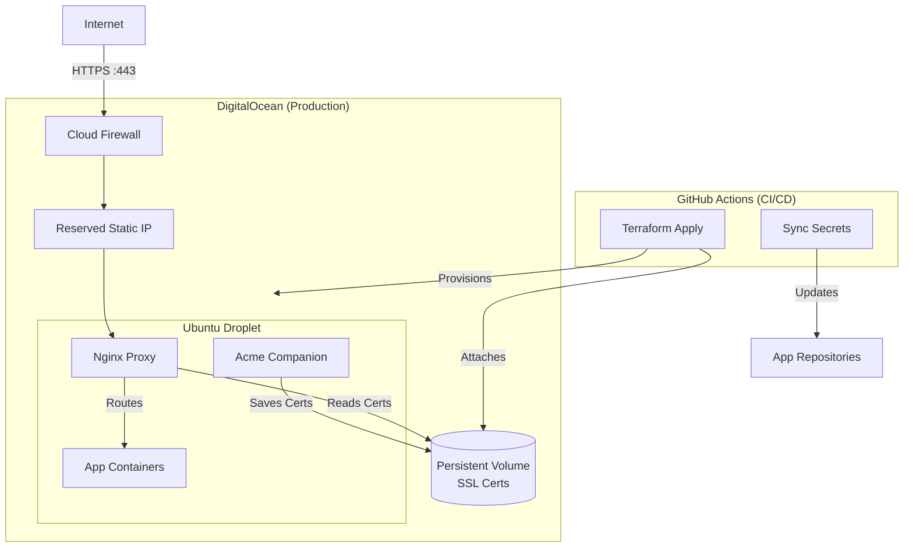

# 🛠 Spec-Forge Infrastructure

[](https://www.digitalocean.com)
[](https://cloud.hashicorp.com/products/terraform)

[](https://www.terraform.io)
[](https://docs.docker.com/compose/)
[](https://nginx.org)

Infrastructure-as-Code for **Spec-Forge**. This repository manages the production environment on DigitalOcean using
Terraform and GitHub Actions.

---

## 🚀 Quick Start

### 📋 Prerequisites

Ensure you have the following environment configurations before starting:

* **Terraform CLI** installed
* **Required secrets** (see below)

### 💻 Run Locally

Run from the infra/ directory:

```bash
terraform login
terraform init
terraform plan \
  -var="digital_ocean_token=$DIGITAL_OCEAN_TOKEN" \
  -var="server_ssh_public_key=$SERVER_SSH_PUBLIC_KEY" \
  -var="gh_secret_sync_token=$GH_SECRET_SYNC_TOKEN" \
  -var="tf_cloud_organization=$TF_CLOUD_ORGANIZATION" \
  -var="tf_cloud_workspace=$TF_CLOUD_WORKSPACE" \
  -var="gh_target_repositories=$GH_TARGET_REPOSITORIES"
```

---

## 🔄 CI/CD Pipeline

| Event            | Action            | Description                                                         |
|:-----------------|:------------------|:--------------------------------------------------------------------|
| **Pull Request** | `terraform plan`  | Validates changes and posts the plan to the PR                      |
| **Tag (`v*`)**   | `terraform apply` | Provisions infrastructure, configures the server, and syncs secrets |

---

## 🔑 Required Secrets

* `DIGITAL_OCEAN_TOKEN`: For resource provisioning
* `HCP_TERRAFORM_TOKEN`: For remote state management
* `SERVER_SSH_PUBLIC_KEY`: SSH key injected into the root user
* `GH_SECRET_SYNC_TOKEN`: For syncing IP addresses to app repositories
* `TF_CLOUD_ORGANIZATION`: Terraform Cloud organization name
* `TF_CLOUD_WORKSPACE`: Terraform Cloud workspace name
* `GH_TARGET_REPOSITORIES`: List of GitHub repositories that receive the SERVER_IP secret

---

## 🏛️ System Overview

* **State Management:** HashiCorp Cloud Platform Terraform
* **Provider:** DigitalOcean (ams3)
* **OS:** Ubuntu 24.04
* **Network:** Static Reserved IP with Cloud Firewall (Ports 22, 80, 443 allowed)
* **Routing:** Nginx Reverse Proxy with automated Let's Encrypt SSL.



## Zero-Config Routing

Any container joined to the `shared_network` with a `VIRTUAL_HOST` environment variable is automatically detected,
routed, and secured with HTTPS. No manual Nginx configuration is required.

---

## 🔧 Operations

**SSH Access**

```bash
ssh root@v-oleksiienko.xyz
```

## 📤 Outputs

Upon successful completion, Terraform exports:

- **`reserved_ip`** - The static IP address of the server
- **`domain_name`** - The primary DNS entry

---

## ⚖️ License

This project is licensed under the **GNU Affero General Public License v3.0 (AGPL-3.0)**.
